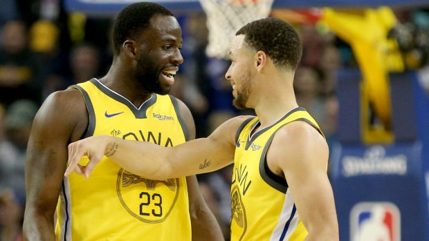
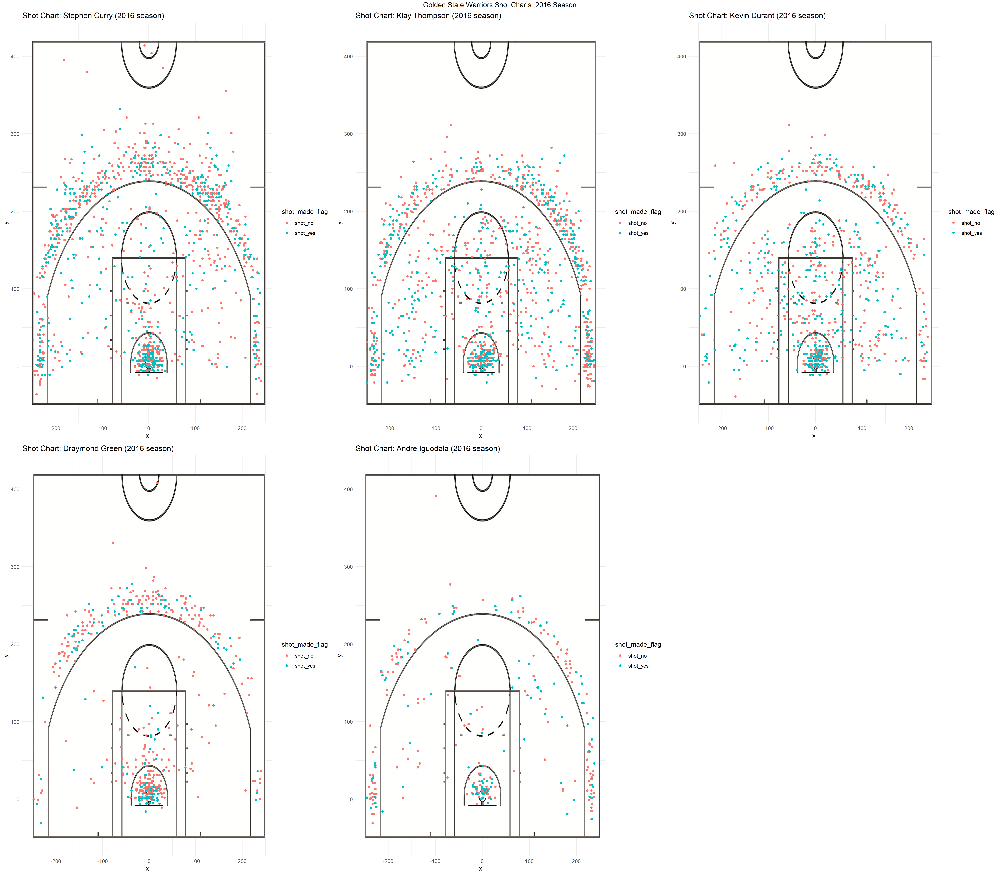
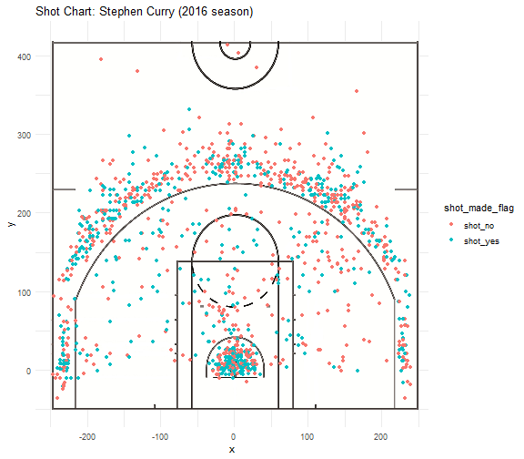
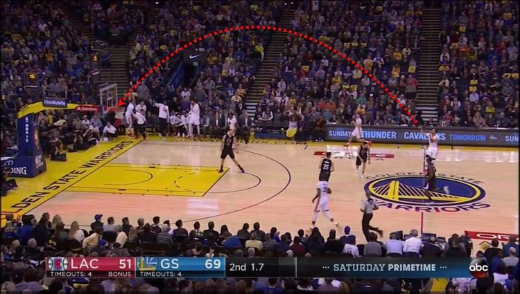

Narritive Report
================
Jacob Fajnor

### Golden State Warriors Shot Chart Project

 They are the goliaths of modern day NBA basketball, stampeding through season play and playoff brackets. From Stephen Curry's electric 3 pointers to the bullet-proof defense of Draymond Green, the warriors can be counted on to produce an exciting game of basketball that will enrapture the attention of even the most adamant anti-sports fans. But there is a small problem. Highlight reels and fan articles often times only reflect the optimism fans have over a teams play style and over emphasize the actual performance of various athletes. If you were to only watch ESPN you could easily believe that Stephan Curry never misses from half court and Draymond Green never fouls out. Thus I have used data from the 2016 season to examine effective shooting percentages and shot charts to try to gain a better understanding of how good of shooters the warriors actually are as individuals as well as try to gain some insight into how the Warriors play to their strengths to create some of the magical moments on the court that we as fans have come to know and love. The Golden State warriors secured another NBA championship title in the 2016-17 season and due to the success of that season, I will be using shot data from this specific season. In addition, I have limited my data to include the headline players who we often find on highlight reels and starting lineups. Those players are Stephan Curry, Klay Thompson, Draymond Green, Andre Iguodala, and Kevin Durant. I was able to obtain .csv data sets that included numerous types of shot data (see data dictionary). I primarily concerned myself with the variables of player name, shot\_made\_flag, and the x and y coordinates on a basketball court for showing where the shot was taken from. In addition to these variables, I also manipulated the data to create a variable "minutes" `igoudala$shot_made_flag <- ifelse(igoudala$shot_made_flag == "n", "shot_no", "shot_yes")`

`curry$shot_made_flag <- ifelse(curry$shot_made_flag == "n", "shot_no", "shot_yes")`

`thompson$shot_made_flag <- ifelse(thompson$shot_made_flag == "n", "shot_no", "shot_yes")`

`durant$shot_made_flag <- ifelse(durant$shot_made_flag == "n", "shot_no", "shot_yes")`

`green$shot_made_flag <- ifelse(green$shot_made_flag == "n", "shot_no", "shot_yes")`

as well as two binary variables to create some effective shooting percentages later on. Once this data have been compiled for each individual player, I then combined each data set into one larger shot-data.csv dataset which would be my main data source for generating shot charts and effective shooting percentages. One of the primary objectives of this assignment was to create shot charts that were color coded to represent whether or not the shot was made or missed as well as the various locations around the court where the shot was taken from. To give a better reference for where on a basketball court the shot was taken, I used a JPEG file of standard NBA court markings to provide a background to the scatterplots. The resulting plots are shown below: 

From looking at the shot charts we can clearly see at a glance that these players have various different strengths and weaknesses in their shooting patterns. For example, Stephen Curry likes to play the long ball, with a high concentration of 3 point shots and very few two point field goals outside the key. By comparison, Draymond Green and Andre Iguodala take most of their shots from within the key. The color concentrations of the dots also indicate (this will be proven with further numerical analysis) that each of these players likes to play to their strengths. For example, Igoudala does not attempt many three point shots while Stephen Curry mostly shoots from outside the three point line or drives for a layup. For reference these scatterplots were generated using the following code:

`player <- filter(data, name == "player name") iguodala_shot_chart <- ggplot(data = iguodala) +   annotation_custom(court_image, -250, 250, -50, 420) +   geom_point(aes(x = x, y = y, color = shot_made_flag)) +   ylim(-50, 420) +   ggtitle('Shot Chart: Andre Iguodala (2016 season)') +   theme_minimal() player_shot_chart`

If we take a deeper dive into Stephen Curry's shot chart, we see some interesting characteristics about his performance vs how many sports medial outlets portray his performance.  While there are some spectacular three pointers (Curry's signature shot) we see that many of the shots taken far beyond the three point line are missed, and furthermore most of Curry's three pointers are taken from the traditional spots along the three point line. This presents a contrast to how he is general depicted, almost at half court . In addition, curry is often regarded in basketball as a "little guy" or a smaller player who often struggles with the physicality that occurs under the hoop. However, the data shows a large concentration of layup two point field goals for Curry, suggesting that he is quite effective driving to the. This supports why Curry is such a difficult player to defend, he can both stop outside the line and shoot a three pointer with deadly accuracy but if you guard against the three point shot too closely, he can deftly navigate his way to the basket and score layups. By contrast we can see players like Draymond Green and Andre Iguodala having high concentrations of completed shots near the basket, demonstrating that they can reliably drive through defenders or rebound missed shots and score.

    The various  visual patterns I have described above are represented by this table of effective shooting percentages 

#### Three Point Percentage

| Player         | Total | Made | Percent Made |
|----------------|-------|------|--------------|
| Andre Iguodala | 161   | 58   | 36.02484     |
| Draymond Green | 232   | 74   | 31.89655     |
| Kevin Durant   | 272   | 105  | 38.60294     |
| Klay Thompson  | 580   | 246  | 42.41379     |
| Stephen Curry  | 687   | 280  | 40.75691     |

#### Two Point Percentage

| Player         | Total | Made | Percent Made |
|----------------|-------|------|--------------|
| Andre Iguodala | 210   | 134  | 63.80952     |
| Draymond Green | 346   | 171  | 49.42197     |
| Kevin Durant   | 643   | 390  | 60.65319     |
| Klay Thompson  | 640   | 329  | 51.40625     |
| Stephen Curry  | 563   | 304  | 53.99645     |

#### Total Percentage

| Player         | Total | Made | Percent Made |
|----------------|-------|------|--------------|
| Andre Iguodala | 371   | 192  | 51.75202     |
| Draymond Green | 578   | 245  | 42.38754     |
| Kevin Durant   | 915   | 495  | 54.09836     |
| Klay Thompson  | 1220  | 575  | 47.13115     |
| Stephen Curry  | 1250  | 584  | 46.72000     |

We can see from the numeric analysis here that the various strengths of each player showing in the shot chart are replicated. This lends itself to a theory of how the Warriors continue to dominate NBA play year after year: they play to their strengths. Instead of every player trying to shoot glorified three pointers or drive to the hoop for a dunk on ever play, the warriors are allowing the better three point shooters to shoot the long ball while more physical players tend to be recovering rebounds and scoring on those missed shots. The warriors also appear to understand who is a more consistent shooter and distribute the ball to players such as Curry, Durant, and Thompson for a higher number of shots from these players. This is not a down playing of the role of more defensive or rebound specialized players such as Draymond Green or Andre Iguodala, we are only examining one small niche of season data, but it does demonstrate that the Warriors have a more efficient play style than other teams, thus leading to a higher success rate when shooting. Thus maybe the most important take away from the Warriors domination of the NBA is not that they rely on pure freak athleticism, but rather that they simply play as a team better than all other competition they face.
